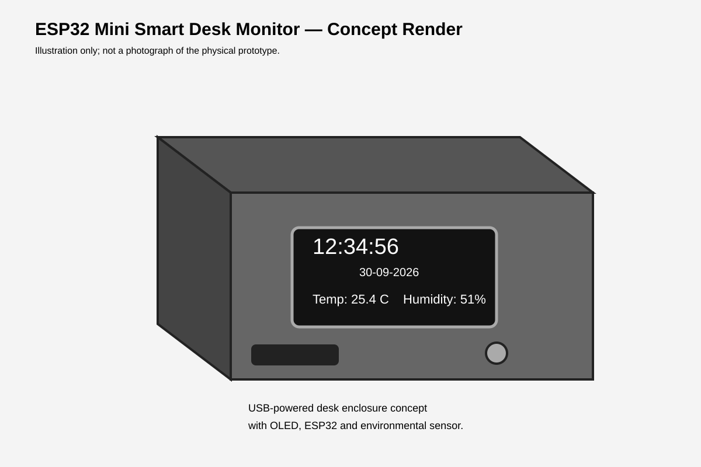
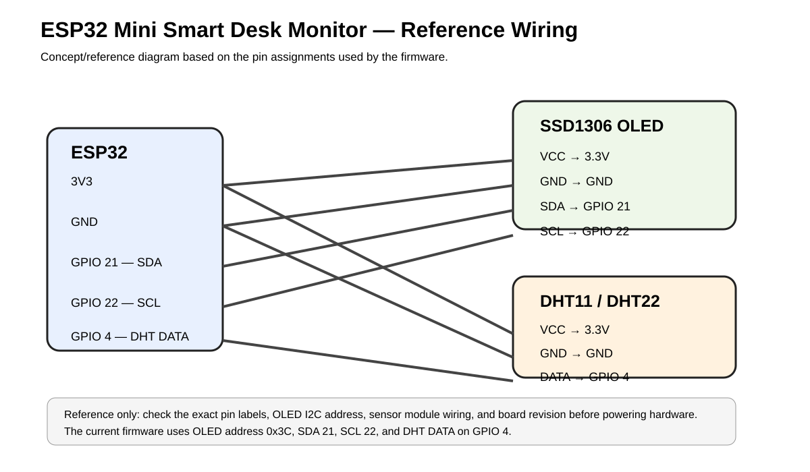

# ESP32 Mini Smart Desk Monitor

A compact ESP32 desk display that combines a Wi-Fi-synchronized clock with live temperature and humidity readings on an OLED screen.

## Problem solved

A normal desk clock only shows the time, while checking temperature and humidity usually requires a separate thermometer/hygrometer or opening an app. This project combines those everyday readings into one small, USB-powered device that can sit on a desk, workstation, gaming setup, or dashboard.

## Prototype / concept visuals

> **Note:** The visuals below are reference illustrations created for documentation. They are **not photographs of the physical prototype** and are not presented as measured CAD of the current handmade frame.





## Features

- Wi-Fi-synchronized clock using NTP
- Live temperature monitoring
- Live humidity monitoring
- 128×64 I2C OLED display
- USB powered
- Custom handmade metal frame
- Simple firmware that can be expanded with more sensors and features

## Hardware

- ESP32 development board
- 0.96-inch SSD1306 128×64 I2C OLED
- DHT11 or DHT22 temperature/humidity sensor
- Jumper wires
- USB cable/power source
- Custom metal frame/enclosure

## Bill of Materials

The complete BOM is available in [`hardware/BOM.csv`](hardware/BOM.csv).

| Part | Qty | Notes |
|---|---:|---|
| ESP32 development board | 1 | ESP32 DevKitC-style reference |
| SSD1306 128×64 I2C OLED | 1 | Verify module address before assembly |
| DHT22 temperature/humidity sensor | 1 | DHT11 is supported by changing one firmware setting |
| 4.7K–10K resistor | 1 | Needed for a bare DHT22; many modules already include a pull-up |
| Jumper wires | ~8 | Prototype wiring |
| USB cable | 1 | Connector depends on ESP32 board revision |
| Metal enclosure material | 1 set | Handmade/custom; measure your actual prototype |

## Hardware design files

Reference CAD/design files are included under [`hardware/`](hardware/):

- [`desk_monitor_reference.scad`](hardware/enclosure/desk_monitor_reference.scad) — editable OpenSCAD enclosure reference
- [`reference_baseplate.stl`](hardware/enclosure/reference_baseplate.stl) — simple printable reference baseplate
- [`wiring_diagram.svg`](hardware/wiring_diagram.svg) — editable/vector wiring diagram
- [`concept_render.svg`](hardware/concept_render.svg) — documentation concept render

The enclosure files are deliberately labeled **reference** because the exact dimensions of the handmade metal frame were not measured from the physical prototype.

## Wiring

### OLED (SSD1306 I2C)

| OLED | ESP32 |
|---|---|
| VCC | 3.3V |
| GND | GND |
| SDA | GPIO 21 |
| SCL | GPIO 22 |

### DHT sensor

| DHT | ESP32 |
|---|---|
| VCC | 3.3V |
| GND | GND |
| DATA | GPIO 4 |

Many DHT sensor modules already include the required pull-up resistor. For a bare sensor, use the resistor recommended by its datasheet.

## Software setup

### Arduino IDE

Install the ESP32 board package and these libraries:

- Adafruit SSD1306
- Adafruit GFX Library
- DHT sensor library by Adafruit
- Adafruit Unified Sensor

Open `src/esp32_smart_desk_monitor.ino`, enter your Wi-Fi credentials, select your ESP32 board, and upload.

### PlatformIO

This repository includes `platformio.ini`. Open the project in PlatformIO and build/upload normally.

## Configuration

At the top of the sketch:

```cpp
const char* WIFI_SSID = "YOUR_WIFI_NAME";
const char* WIFI_PASSWORD = "YOUR_WIFI_PASSWORD";
```

Default settings:

- OLED address: `0x3C`
- I2C SDA: GPIO 21
- I2C SCL: GPIO 22
- DHT data: GPIO 4
- DHT type: DHT22
- Time zone: Asia/Kolkata (UTC+5:30)

For a DHT11, change:

```cpp
#define DHTTYPE DHT22
```

to:

```cpp
#define DHTTYPE DHT11
```

## How it works

1. The ESP32 connects to Wi-Fi.
2. It synchronizes local time from an NTP server.
3. The DHT sensor provides temperature and humidity readings.
4. The ESP32 refreshes the OLED with the current time, date, temperature, and humidity.
5. If a sensor read fails, the last valid reading is retained.

## Reference component documentation

- [Espressif ESP32-DevKitC documentation](https://docs.espressif.com/projects/esp-dev-kits/en/latest/esp32/esp32-devkitc/)
- [Adafruit DHT22](https://www.adafruit.com/product/385)
- [Adafruit SSD1306 OLED wiring guide](https://learn.adafruit.com/monochrome-oled-breakouts/wiring-128x64-oleds)

## Project structure

```text
.
├── README.md
├── LICENSE
├── platformio.ini
├── src/
│   └── esp32_smart_desk_monitor.ino
├── hardware/
│   ├── BOM.csv
│   ├── concept_render.svg
│   ├── wiring_diagram.svg
│   └── enclosure/
│       ├── desk_monitor_reference.scad
│       └── reference_baseplate.stl
└── esp32-mini-smart-desk-monitor.zip
```

## Future ideas

- Weather information
- Air-quality sensor
- Automatic display brightness
- Alarm/timer
- Minimum/maximum temperature history
- CO₂ monitoring
- Room-status icons
- Improved enclosure

## Status

Latest prototype. The enclosure and additional features are still being improved.

## License

MIT License. See [LICENSE](LICENSE).